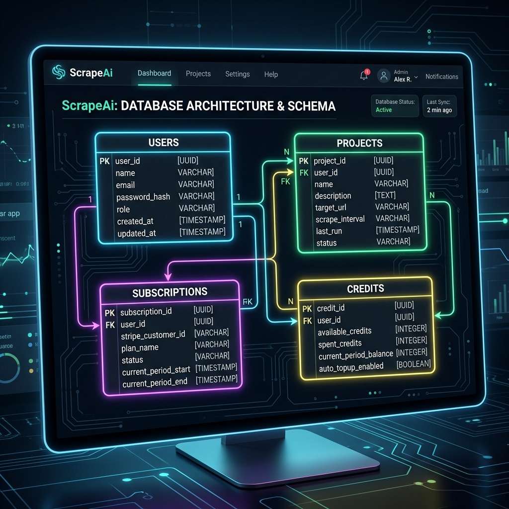

# Full Stack Generative UI Designer with Next JS, Convex, Gemini AI, Polar Billing, Inngest, Tailwind CSS


---

## 📋 Table of Contents

- [Overview](#overview)
- [Tech Stack](#tech-stack)
- [Features](#features)
- [Getting Started](#getting-started)
- [Environment Variables](#environment-variables)
- [Database Setup](#database-setup)

---

## Overview

A full-stack AI-powered web mockup and React component designer where users sketch elements, describe their design requirements, and the AI writes production-ready responsive layout code that renders live in the browser — similar to Bolt.new or Lovable.

Users get an interactive design canvas, a persistent chat history, instant styling guidelines, and a credit-based subscription system with automated top-ups.

---

## Tech Stack

| Layer | Technology |
|---|---|
| Framework | Next.js 15 (App Router, TypeScript) |
| Backend & Database | Convex |
| Authentication | Convex Auth (Google OAuth, Password Flow) |
| Billing & Payments | Polar (`@polar-sh/sdk`) |
| Background Jobs | Inngest |
| AI Integration | Vercel AI SDK (`ai`) & Gemini AI |
| State Management | Redux Toolkit (`@reduxjs/toolkit`) |
| UI Controls | Base UI (`@base-ui/react`) & Shadcn UI |
| Styling | Tailwind CSS v4 + PostCSS |

---

## Features

### Landing Page
- Prompt textarea with Rotating Placeholders and suggestions
- Live preview mockup grid showcasing responsive prototypes
- Dark mode theme throughout with smooth CSS micro-animations

### Auth (Convex Auth)
- Secure Google OAuth and email password login flows
- User accounts auto-provisioned in database upon first-time sign-in
- Real-time navigation menu controls via user avatar dropdown
- Settings panel modal to customize profile details (name and avatar URL) and log out of active sessions

### Workspace & Interactive Canvas
- Left-panel AI chat interface + Right-panel design workspace (Canvas & Style Guide)
- Interactive canvas supporting sketching shapes (frames, rectangles, ellipses, freehand lines, arrows) and adding text nodes
- Complete Undo & Redo historical state stacks for layout sketching, shape moving, resizing, styling, and deletions
- Real-time Redux synchronization component listening to backend database updates and updating client state dynamically

### Generative UI Generation (`/api/generate`)
- Integration with Gemini AI Models (Gemini 3.5 Flash) via Vercel AI SDK
- Custom prompt templates mapping user input to Tailwind utility classes
- Streams generated component structures and updates canvas content instantly
- Inngest orchestrations for complex background generation events

### Billing & Subscription Plan
- SaaS integration with Polar handles subscription payments, invoices, and credit balances
- Dedicated Billing screen showcasing current subscription plan benefits and checkout redirection
- Webhook endpoints listening for subscription events to adjust credit balances and top up limits

---

## Getting Started

### Prerequisites

- Node.js 22+
- A Convex developer account and local CLI setup
- A Google AI Studio API key (Gemini)
- A Polar Sandbox developer account

### Installation

Clone the repository and install dependencies:

```bash
git clone https://github.com/aayushsoni-ai/scrapeai.git
cd scrapeai
npm install
```

Start the Convex backend server in a separate terminal:

```bash
npx convex dev
```

Run the Inngest local development server:

```bash
npx inngest-cli@latest dev
```

Run the Next.js development server:

```bash
npm run dev
```

Open [http://localhost:3000](http://localhost:3000) with your browser to see the app.

---

## Environment Variables

Create a `.env.local` file in the root directory:

```env
# Convex Backend
CONVEX_DEPLOYMENT=
NEXT_PUBLIC_CONVEX_URL=
NEXT_PUBLIC_CONVEX_SITE_URL=
CONVEX_SITE_URL=

# Gemini AI Key
GOOGLE_GENERATIVE_AI_API_KEY=

# Polar Billing Integration
POLAR_ACCESS_TOKEN=
POLAR_WEBHOOK_SECRET=
POLAR_ENV=sandbox
POLAR_STANDARD_PLAN=

# Inngest Keys
INNGEST_SIGNING_KEY=
INNGEST_EVENT_KEY=
INNGEST_DEV=0

# Next App Settings
NEXT_PUBLIC_APP_URL=http://localhost:3000

# Google OAuth Credentials (for Convex Auth)
CLIENT_ID=
CLIENT_SECRET=
```

---

## Database Setup

The database is built on Convex with a fully-typed schema defined in `convex/schema.ts`:

- **users** — user profile records created upon first authentication (email, image, name, etc.).
- **subscriptions** — user subscription status and credit ledger balances synced from Polar webhook calls.
- **credits_ledger** — logs detailing credit grant and consumption history for auditing.
- **projects** — stores design configurations, canvas shape nodes (viewport, sketches, layout metadata), and history states.
- **project_counters** — auto-incrementing project sequence counters per user.



---

## 🌟 Show your support

Give a ⭐ if this project helped you learn something new!
